# T-Mobile Live Translation Service - Competitive Implementation Blueprint

**Document Version:** 3.1  
**Date:** February 12, 2026  
**Classification:** Confidential - Internal Use

---

## Table of Contents

1. [Executive Summary](#executive-summary)
2. [Service Overview](#service-overview)
 3. [Requirements Analysis](#requirements-analysis)
   - 3.1 Functional Requirements
   - 3.2 Non-Functional Requirements
   - 3.3 Technical Requirements
   - 3.4 Business Requirements
   - 3.5 Regulatory & Compliance Requirements
   - 3.6 Language Detection Recovery
4. [System Architecture](#system-architecture)
5. [BSS/OSS Integration](#bssoss-integration)
   - 5.1 TM Forum Traceability Matrix
6. [Implementation Roadmap](#implementation-roadmap)
7. [Cost Considerations](#cost-considerations-technical)
8. [Risk Assessment](#risk-assessment)
9. [Key Success Factors](#key-success-factors)
10. [Conclusion](#10-conclusion)
11. [Appendix](#appendix)

---

## 1. Executive Summary

T-Mobile has announced **Live Translation**, a network-native real-time voice translation service that requires no app installation and works via an in-call keypad code (`*87*`). This document provides a comprehensive blueprint for another telco to replicate this service, including deep-dive requirements analysis, high-level technical architecture, and BSS/OSS integration considerations.

**Key Differentiators:**
- Carrier-hosted AI on 4G LTE/5G voice network with edge acceleration
- No app required (works with feature phones)
- 50+ language support with real-time bidirectional translation
- Zero-call-retention privacy model with lawful intercept compliance

---

## 2. Service Overview

### 2.1 Service Features

| Feature | Description |
|---------|-------------|
| **Real-time Translation** | Bidirectional voice-to-voice translation during active calls |
| **Language Support** | 50+ languages with automatic detection |
| **Activation Method** | In-call keypad code (`*87*`) using MMI/USSD/IMS supplementary-service control by network implementation |
| **Device Compatibility** | Any compatible phone on 4G LTE/5G voice service, including feature phones and smartphones |
| **Privacy Model** | No call recordings or transcripts stored post-call (with CALEA-compliant intercept) |
| **Network Coverage** | Domestic 4G LTE/5G with MEC where available; regional cloud processing for coverage/overflow; eligible roaming markets by policy |

### 2.2 Target Market Segments

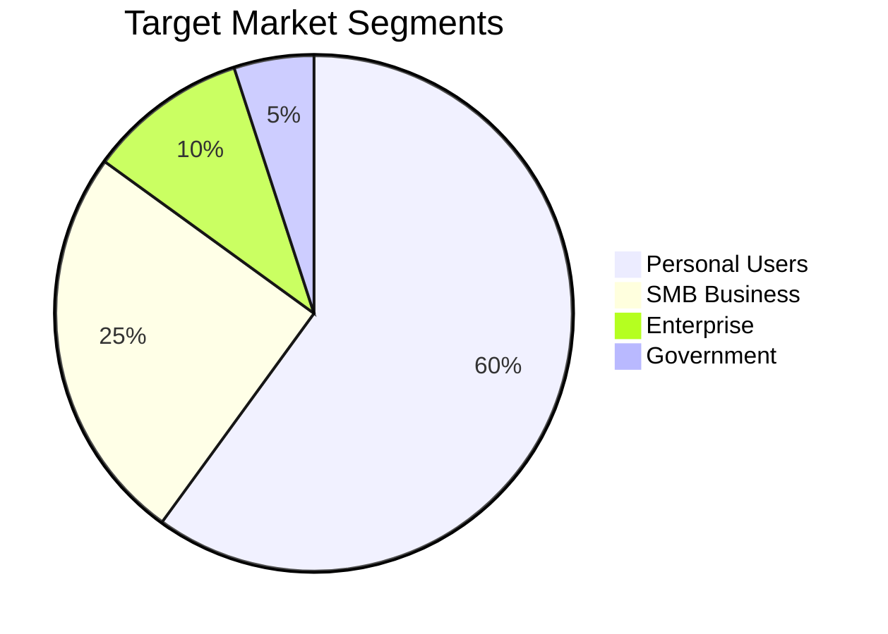
```mermaid
pie title Target Market Segments
    "Personal Users" : 60
    "SMB Business" : 25
    "Enterprise" : 10
    "Government" : 5
```

---

## 3. Requirements Analysis

### 3.1 Functional Requirements

| ID | Requirement |
|----|------------|
| FR-001 | Real-time bidirectional voice-to-voice translation during active calls |
| FR-002 | Support 50+ languages with auto-detection (with manual override) |
| FR-003 | In-call activation/deactivation via keypad control (e.g., `*87*`) |
| FR-004 | No-app operation and feature phone compatibility |
| FR-005 | Work for subscriber to non-subscriber calls |
| FR-006 | Provide translation confidence and quality signals (metadata) |
| FR-007 | Optional: SMS/text translation (post-MVP unless required) |
| FR-008 | Language preference overrides (per subscriber, per call) |
| FR-009 | Usage analytics dashboard (aggregated, no content retention by default) |
| FR-010 | Enterprise branding and customization (post-MVP) |
| FR-011 | Non-subscriber notification (IVR prompt) |
| FR-012 | Emergency and crisis call bypass (911/988) |
| FR-013 | Graceful degradation to pass-through on failures |

#### FR-001: Real-Time Bidirectional Voice-to-Voice Translation

| Attribute | Specification |
|-----------|---------------|
| **Description** | Translate both directions of a conversation in real-time during an active call |
| **Latency Budget** | <500ms end-to-end for conversational flow |
| **Supported Audio** | 8kHz to 48kHz (narrowband to fullband) |
| **Speaker Count** | 2-way calls in MVP; 3-way conference in Phase 2+ |

#### FR-004: Feature Phone Compatibility

| Requirement | Rationale |
|-------------|-----------|
| No app installation required | Feature phones lack app store access |
| In-call keypad activation (`*87*`) | Works across device tiers without app dependency |
| No smartphone OS dependency | Works with basic phones, flip phones |
| No data requirement beyond voice call | Uses voice channel |

#### FR-011: Non-Subscriber Notification

| Requirement | Description |
|-------------|-------------|
| **IVR Announcement** | Non-subscribers hear automated prompt: "Call translation is active" |
| **Consent Awareness** | Notification indicates speech is being processed by AI |
| **Regulatory Compliance** | Addresses two-party consent jurisdictions |

#### FR-012: Emergency Call Bypass

| Requirement | Description |
|-------------|-------------|
| **Auto-disable on 911/988** | Translation automatically deactivated for emergency and crisis calls |
| **Emergency Audio Priority** | Original caller voice transmitted without modification |
| **Quick Reactivation** | User can re-enable after emergency call if needed |

#### FR-013: Graceful Degradation

| Requirement | Description |
|-------------|-------------|
| **Pass-through on failure** | Call continues without translation if AI pipeline fails |
| **Automatic failover** | Switch to alternate MEC site or cloud if primary unavailable |
| **User notification** | Audio or visual notification when translation unavailable |

### 3.2 Non-Functional Requirements

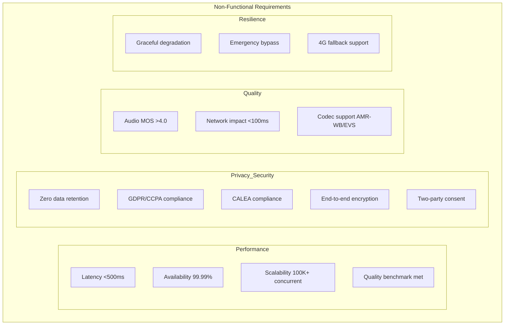
```mermaid
graph TB
    subgraph NFR["Non-Functional Requirements"]
        subgraph Performance
            NFR1[Latency <500ms]
            NFR2[Availability 99.99%]
            NFR3[Scalability 100K+ concurrent]
            NFR4[Quality benchmark met]
        end
        subgraph Privacy_Security
            NFR5[Zero data retention]
            NFR6[GDPR/CCPA compliance]
            NFR7[CALEA compliance]
            NFR8[End-to-end encryption]
            NFR9[Two-party consent]
        end
        subgraph Quality
            NFR10[Audio MOS >4.0]
            NFR11[Network impact <100ms]
            NFR12[Codec support AMR-WB/EVS]
        end
        subgraph Resilience
            NFR13[Graceful degradation]
            NFR14[Emergency bypass]
            NFR15[4G fallback support]
        end
    end
```

#### Performance Requirements

| Metric | Target | Measurement |
|--------|--------|-------------|
| **End-to-end latency** | <500ms (5G+MEC), <1000ms (4G+cloud) | Time from speech input to translated audio output |
| **Availability** | 99.99% | Monthly uptime SLA |
| **Scalability** | 100,000+ concurrent calls | Peak hour capacity |
| **Translation quality** | >=0.82 COMET + >=4.2/5 human adequacy on opt-in sampled corpus | Defined language-pair benchmark set |
| **Audio MOS** | >4.0 (EVS/AMR-WB), >3.5 (AMR-NB narrowband) | Mean Opinion Score by codec |
| **Initiation time** | <3 seconds | Time from `*87*` input to translation active |

#### Privacy Requirements

| Requirement | Implementation |
|-------------|----------------|
| **Zero retention (default path)** | Audio buffered only in memory and discarded after inference; no persistent content storage |
| **No transcript storage (default path)** | Text translations discarded immediately after synthesis; persistent storage allowed only for lawful intercept orders or explicit QA opt-in corpora |
| **Explicit consent** | One-time opt-in required per subscriber |
| **Non-subscriber notification** | IVR prompt to other party when translation activates |
| **Audit trail** | Logs contain only metadata (no content) |
| **Data sovereignty** | Regional processing (EU, US, APAC) |
| **Two-party compliance** | Notification and consent handling per jurisdiction |

### 3.3 Technical Requirements

#### Network Infrastructure Requirements

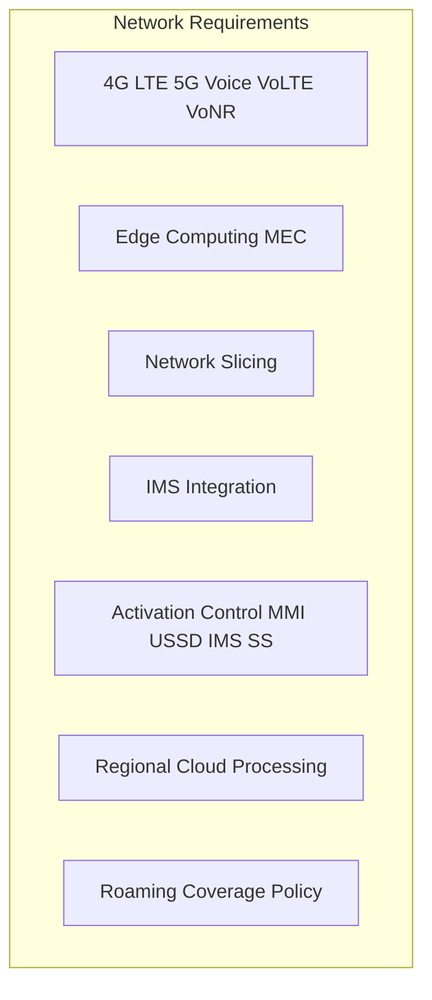
```mermaid
graph TB
    subgraph Network_Req["Network Requirements"]
        R1[4G LTE 5G Voice VoLTE VoNR]
        R2[Edge Computing MEC]
        R3[Network Slicing]
        R4[IMS Integration]
        R5[Activation Control MMI USSD IMS SS]
        R6[Regional Cloud Processing]
        R7[Roaming Coverage Policy]
    end
```

| Requirement | Specification |
|-------------|---------------|
| **4G LTE/5G Voice Baseline** | Service must function on VoLTE/VoNR; 5G improves latency but is not mandatory |
| **Edge Computing (MEC)** | Translation engines deployed at network edge for latency |
| **Network Slicing** | Dedicated slice for translation QoS guarantees |
| **IMS Integration** | Call control, session anchoring, media routing |
| **Activation Control** | Handle in-call activation/deactivation via `*87*`; implementation may use MMI, USSD, or IMS supplementary service control |
| **Regional Cloud Processing** | Cloud-based processing for markets without MEC and for overflow; degraded latency target <1000ms |
| **4G Activation Policy** | Service remains available on 4G LTE with disclosure: "Higher latency may occur outside edge coverage" |
| **Roaming Support** | Enable service in eligible roaming markets where policy, routing, and compliance requirements are met |

#### AI/ML Infrastructure Requirements

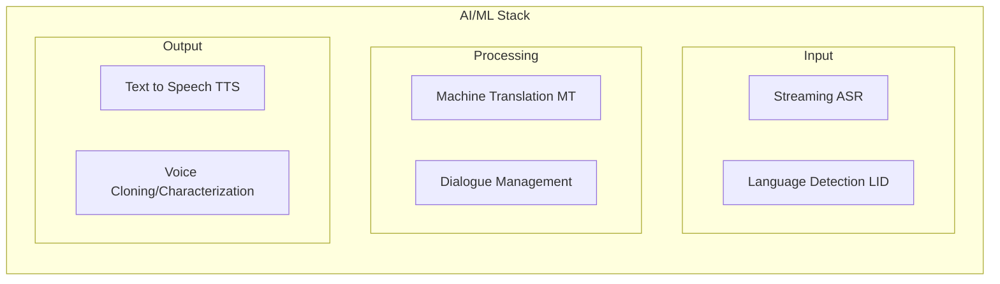
```mermaid
graph LR
    subgraph AI_Stack["AI/ML Stack"]
        subgraph Input
            ASR[Streaming ASR]
            LID[Language Detection LID]
        end
        subgraph Processing
            MT[Machine Translation MT]
            DM[Dialogue Management]
        end
        subgraph Output
            TTS[Text to Speech TTS]
            VC[Voice Cloning/Characterization]
        end
    end
```

| Component | Technology Options | Selection Criteria |
|-----------|-------------------|-------------------|
| **ASR** | **Streaming**: Deepgram, AssemblyAI, Azure STT, Google Cloud Speech-to-Text (Streaming) | **Streaming capability critical** (batch APIs won't meet latency), accuracy, latency |
| **MT** | GPT-4o, NLLB, MarianMT, Google Translate | Language coverage, conversational context |
| **TTS** | ElevenLabs, Azure TTS, VITS, Commercial APIs | Voice quality, latency, customization |
| **LID** | langdetect, fastText, Custom models | Accuracy on short utterances |
| **Speaker Diarization** | Pyannote, Custom models | Turn-taking accuracy |

### 3.4 Business Requirements

| Category | Requirement |
|----------|-------------|
| **Cost Model** | Subscription-based pricing (Free/Basic/Premium/Enterprise tiers) |
| **Monetization** | Free beta → Paid tiers: Basic ($9.99/mo), Premium ($19.99/mo), Enterprise (custom) |
| **Pricing Strategy** | Competitive with third-party apps (Google Translate consumer app is free; Cloud API is enterprise reference) |
| **Market Positioning** | "Network is the computer" - carrier-native advantage |
| **Go-to-Market** | Beta → Early Adopters → General Availability |
| **Support Model** | 24/7 multilingual customer support |

### 3.5 Regulatory & Compliance Requirements

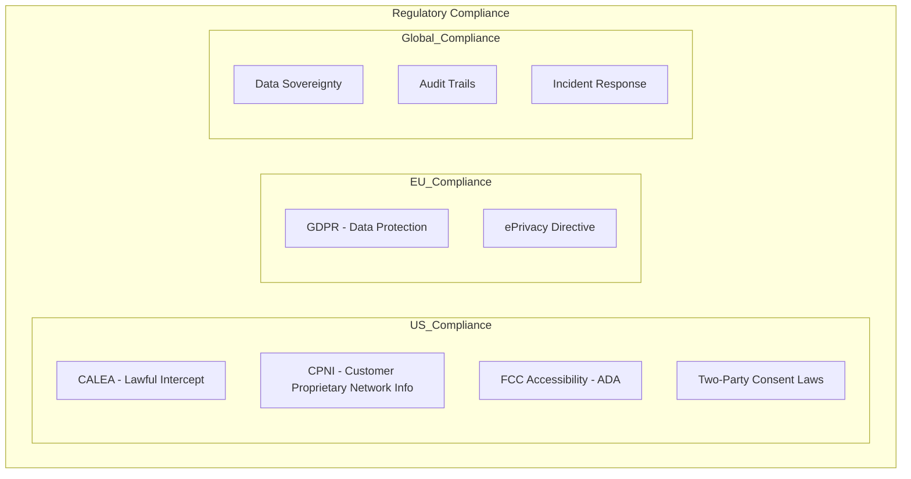
```mermaid
graph TD
    subgraph Compliance["Regulatory Compliance"]
        subgraph US_Compliance
            C1[CALEA - Lawful Intercept]
            C2[CPNI - Customer Proprietary Network Info]
            C3[FCC Accessibility - ADA]
            C4[Two-Party Consent Laws]
        end
        subgraph EU_Compliance
            C5[GDPR - Data Protection]
            C6[ePrivacy Directive]
        end
        subgraph Global_Compliance
            C7[Data Sovereignty]
            C8[Audit Trails]
            C9[Incident Response]
        end
    end
```

| Regulation | Compliance Requirement |
|------------|----------------------|
| **CALEA (US)** | Support lawful intercept with call content and translation metadata. **Working architecture assumption (pending legal counsel):** place intercept at IMS media path before translation to guarantee original audio capture; treat translated output handling as a jurisdiction-specific legal decision and maintain capability to provide translated artifacts when required by lawful order. |
| **Two-Party Consent (US)** | IVR notification to non-subscribers indicating translation is active; call modification disclosed. Jurisdictions requiring explicit consent require non-subscriber acknowledgment before translation activates. |
| **CPNI (US)** | Protect customer network information |
| **GDPR (EU)** | Explicit consent, right to opt-out, data minimization |
| **ePrivacy (EU)** | Confidentiality of communications |
| **ADA (US)** | Accessibility for hearing-impaired users |
| **CCPA (US)** | Consumer privacy rights, opt-out rights |

### 3.6 Language Detection Recovery

| Scenario | Detection Error Recovery | User Control |
|-----------|----------------------|--------------|
| **Initial detection fails** | Auto-retry after 3 seconds of speech; fallback to user preference if 3 consecutive failures | DTMF code (*87 + language) to manually set target language |
| **Mid-call correction** | Confidence <70% for 5+ utterances triggers re-detection prompt | Voice command "change language" to cycle options |
| **Preference override** | User-set language source/target always auto-selected | CRM-stored preferences applied per-call |

**Detection Accuracy Context:**
- **Greeting accuracy**: 40-60% for short utterances ("hello", "yes", "hola")
- **5-second context accuracy**: 85%+ with sufficient speech content
- **Recovery strategy**: Default to user preferences after failed attempts to avoid poor first impression |

---

## 4. System Architecture

### 4.1 Overall System Architecture

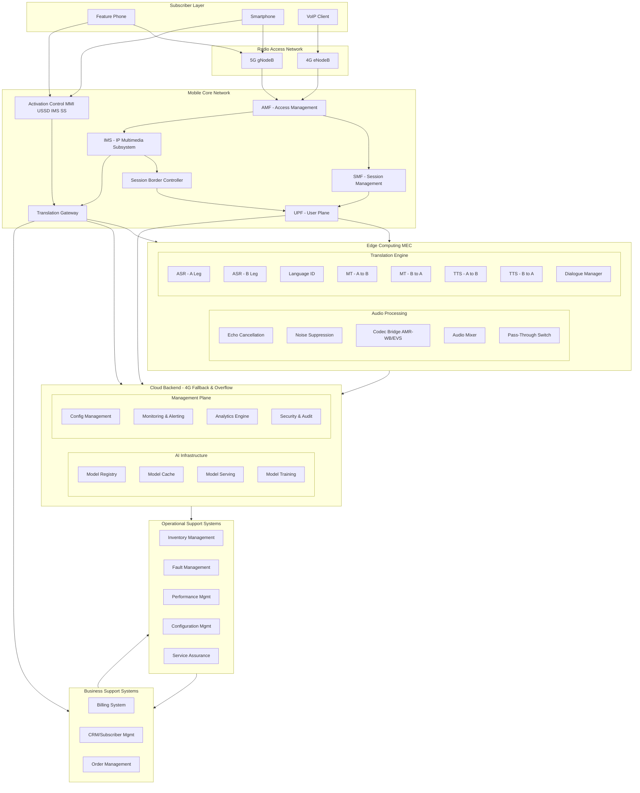
```mermaid
graph TB
    subgraph Subscriber["Subscriber Layer"]
        FP[Feature Phone]
        SP[Smartphone]
        VC[VoIP Client]
    end
    
    subgraph RAN["Radio Access Network"]
        gNB[5G gNodeB]
        eNB[4G eNodeB]
    end
    
    subgraph Core["Mobile Core Network"]
        AMF[AMF - Access Management]
        SMF[SMF - Session Management]
        UPF[UPF - User Plane]
        IMS[IMS - IP Multimedia Subsystem]
        SBC[Session Border Controller]
        ACT[Activation Control MMI USSD IMS SS]
        TG[Translation Gateway]
    end
    
    subgraph Edge["Edge Computing MEC"]
        subgraph Audio_Layer["Audio Processing"]
            EC[Echo Cancellation]
            NS[Noise Suppression]
            CB[Codec Bridge AMR-WB/EVS]
            MX[Audio Mixer]
            PT[Pass-Through Switch]
        end
        subgraph AI_Engine["Translation Engine"]
            ASR_A[ASR - A Leg]
            ASR_B[ASR - B Leg]
            LID[Language ID]
            MT_AtoB[MT - A to B]
            MT_BtoA[MT - B to A]
            TTS_AtoB[TTS - A to B]
            TTS_BtoA[TTS - B to A]
            DM[Dialogue Manager]
        end
    end
    
    subgraph Cloud["Cloud Backend - 4G Fallback & Overflow"]
        subgraph AI_Infra["AI Infrastructure"]
            MR[Model Registry]
            MC[Model Cache]
            MS[Model Serving]
            MT_Training[Model Training]
        end
        subgraph Mgmt_Plane["Management Plane"]
            CF[Config Management]
            MON[Monitoring & Alerting]
            AN[Analytics Engine]
            SEC[Security & Audit]
        end
    end
    
    subgraph BSS["Business Support Systems"]
        BILL[Billing System]
        CRM[CRM/Subscriber Mgmt]
        ORD[Order Management]
    end
    
    subgraph OSS["Operational Support Systems"]
        INV[Inventory Management]
        FAULT[Fault Management]
        PERF[Performance Mgmt]
        CONF[Configuration Mgmt]
        SA[Service Assurance]
    end
    
    FP --> gNB
    SP --> gNB
    VC --> eNB
    gNB --> AMF
    eNB --> AMF
    AMF --> SMF
    SMF --> UPF
    AMF --> IMS
    IMS --> SBC
    SBC --> UPF
    FP --> ACT
    SP --> ACT
    ACT --> TG
    IMS --> TG
    UPF --> Edge
    UPF --> Cloud
    TG --> Edge
    TG --> Cloud
    Edge --> Cloud
    TG --> BSS
    BSS --> OSS
    Cloud --> OSS
    OSS --> BSS
```

### 4.2 Call Flow: Translation Activation

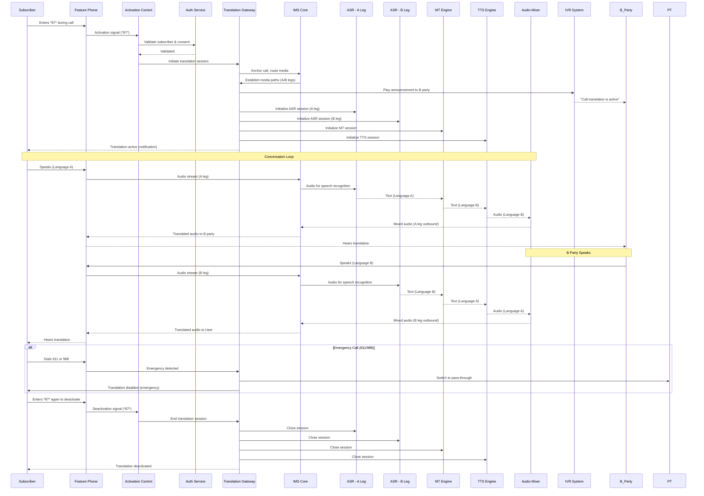
```mermaid
sequenceDiagram
    participant User as Subscriber
    participant Device as Feature Phone
    participant Control as Activation Control
    participant Auth as Auth Service
    participant TG as Translation Gateway
    participant IMS as IMS Core
    participant ASR_A as ASR - A Leg
    participant ASR_B as ASR - B Leg
    participant MT as MT Engine
    participant TTS as TTS Engine
    participant Mixer as Audio Mixer
    participant IVR as IVR System
    
    User->>Device: Enters *87* during call
    Device->>Control: Activation signal (*87*)
    Control->>Auth: Validate subscriber & consent
    Auth-->>Control: Validated
    Control->>TG: Initiate translation session
    TG->>IMS: Anchor call, route media
    IMS->>TG: Establish media paths (A/B legs)
    TG->>IVR: Play announcement to B party
    IVR-->>B_Party: "Call translation is active"
    TG->>ASR_A: Initialize ASR session (A leg)
    TG->>ASR_B: Initialize ASR session (B leg)
    TG->>MT: Initialize MT session
    TG->>TTS: Initialize TTS session
    TG-->>User: Translation active (notification)
    
    Note over User,Mixer: Conversation Loop
    User->>Device: Speaks (Language A)
    Device->>IMS: Audio stream (A leg)
    IMS->>ASR_A: Audio for speech recognition
    ASR_A-->>MT: Text (Language A)
    MT-->>TTS: Text (Language B)
    TTS-->>Mixer: Audio (Language B)
    Mixer-->>IMS: Mixed audio (A leg outbound)
    IMS-->>Device: Translated audio to B party
    Device-->>B_Party: Hears translation
    
    Note over B_Party,Mixer: B Party Speaks
    B_Party->>Device: Speaks (Language B)
    Device->>IMS: Audio stream (B leg)
    IMS->>ASR_B: Audio for speech recognition
    ASR_B-->>MT: Text (Language B)
    MT-->>TTS: Text (Language A)
    TTS-->>Mixer: Audio (Language A)
    Mixer-->>IMS: Mixed audio (B leg outbound)
    IMS-->>Device: Translated audio to User
    Device-->>User: Hears translation
    
    alt Emergency Call (911/988)
        User->>Device: Dials 911 or 988
        Device->>TG: Emergency detected
        TG->>PT: Switch to pass-through
        TG->>User: Translation disabled (emergency)
    end
    
    User->>Device: Enters *87* again to deactivate
    Device->>Control: Deactivation signal (*87*)
    Control->>TG: End translation session
    TG->>ASR_A: Close session
    TG->>ASR_B: Close session
    TG->>MT: Close session
    TG->>TTS: Close session
    TG-->>User: Translation deactivated
```

### 4.3 Media Processing Architecture

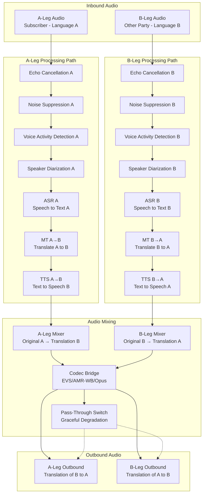
```mermaid
graph TB
    subgraph Inbound["Inbound Audio"]
        A_Leg[A-Leg Audio<br/>Subscriber - Language A]
        B_Leg[B-Leg Audio<br/>Other Party - Language B]
    end
    
    subgraph Processing_A["A-Leg Processing Path"]
        EC_A[Echo Cancellation A]
        NS_A[Noise Suppression A]
        VAD_A[Voice Activity Detection A]
        SD_A[Speaker Diarization A]
        ASR_A[ASR A<br/>Speech to Text A]
        MT_AtoB[MT A→B<br/>Translate A to B]
        TTS_AtoB[TTS A→B<br/>Text to Speech B]
    end
    
    subgraph Processing_B["B-Leg Processing Path"]
        EC_B[Echo Cancellation B]
        NS_B[Noise Suppression B]
        VAD_B[Voice Activity Detection B]
        SD_B[Speaker Diarization B]
        ASR_B[ASR B<br/>Speech to Text B]
        MT_BtoA[MT B→A<br/>Translate B to A]
        TTS_BtoA[TTS B→A<br/>Text to Speech A]
    end
    
    subgraph Mixing["Audio Mixing"]
        MX_A[A-Leg Mixer<br/>Original A → Translation B]
        MX_B[B-Leg Mixer<br/>Original B → Translation A]
        CB[Codec Bridge<br/>EVS/AMR-WB/Opus]
        PT[Pass-Through Switch<br/>Graceful Degradation]
    end
    
    subgraph Outbound["Outbound Audio"]
        A_Out[A-Leg Outbound<br/>Translation of B to A]
        B_Out[B-Leg Outbound<br/>Translation of A to B]
    end
    
    A_Leg --> EC_A
    EC_A --> NS_A
    NS_A --> VAD_A
    VAD_A --> SD_A
    SD_A --> ASR_A
    ASR_A --> MT_AtoB
    MT_AtoB --> TTS_AtoB
    TTS_AtoB --> MX_A
    MX_A --> CB
    
    B_Leg --> EC_B
    EC_B --> NS_B
    NS_B --> VAD_B
    VAD_B --> SD_B
    SD_B --> ASR_B
    ASR_B --> MT_BtoA
    MT_BtoA --> TTS_BtoA
    TTS_BtoA --> MX_B
    MX_B --> CB
    
    CB --> A_Out
    CB --> B_Out
    
    CB --> PT
    PT -.-> B_Out
    PT -.-> A_Out
```

**Mixer Behavior:**
- **Translated audio replaces original audio** in the outbound stream (not mixed)
- **Non-subscriber experience**: Other party hears the AI-translated version of subscriber's speech, not original voice + translation
- Alternative: User preference option to hear both original + translated (e.g., for language learning)
- Mixer operates independently per leg to maintain parallel processing

### 4.4 Data Privacy Flow (with CALEA)

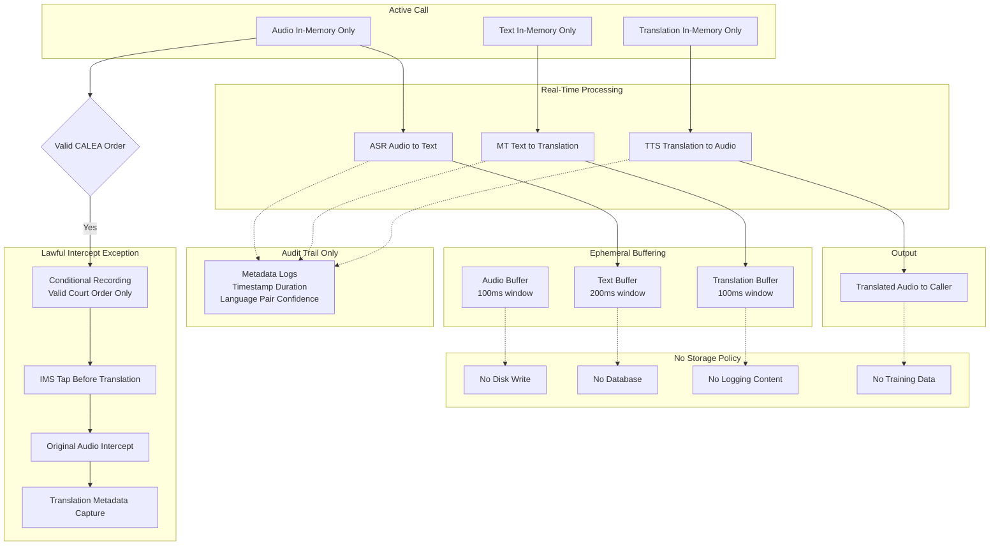
```mermaid
graph TB
    subgraph Call["Active Call"]
        A1[Audio In-Memory Only]
        T1[Text In-Memory Only]
        T2[Translation In-Memory Only]
    end
    
    subgraph Processing["Real-Time Processing"]
        ASR[ASR Audio to Text]
        MT[MT Text to Translation]
        TTS[TTS Translation to Audio]
    end
    
    subgraph Ephemeral["Ephemeral Buffering"]
        B1[Audio Buffer<br/>100ms window]
        B2[Text Buffer<br/>200ms window]
        B3[Translation Buffer<br/>100ms window]
    end
    
    subgraph Output["Output"]
        A_Out[Translated Audio to Caller]
    end
    
    subgraph No_Storage["No Storage Policy"]
        N1[No Disk Write]
        N2[No Database]
        N3[No Logging Content]
        N4[No Training Data]
    end
    
    subgraph Audit["Audit Trail Only"]
        L1[Metadata Logs<br/>Timestamp Duration<br/>Language Pair Confidence]
    end
    
    subgraph CALEA["Lawful Intercept Exception"]
        C1[Conditional Recording<br/>Valid Court Order Only]
        C2[IMS Tap Before Translation]
        C3[Original Audio Intercept]
        C4[Translation Metadata Capture]
    end
    D1{Valid CALEA Order}
    
    A1 --> ASR
    T1 --> MT
    T2 --> TTS
    ASR --> B2
    MT --> B3
    TTS --> A_Out
    B1 -.-> N1
    B2 -.-> N2
    B3 -.-> N3
    A_Out -.-> N4
    ASR -.-> L1
    MT -.-> L1
    TTS -.-> L1
    A1 --> D1
    D1 -->|Yes| C1
    C1 --> C2
    C2 --> C3
    C3 --> C4
```

### 4.5 Graceful Degradation Architecture

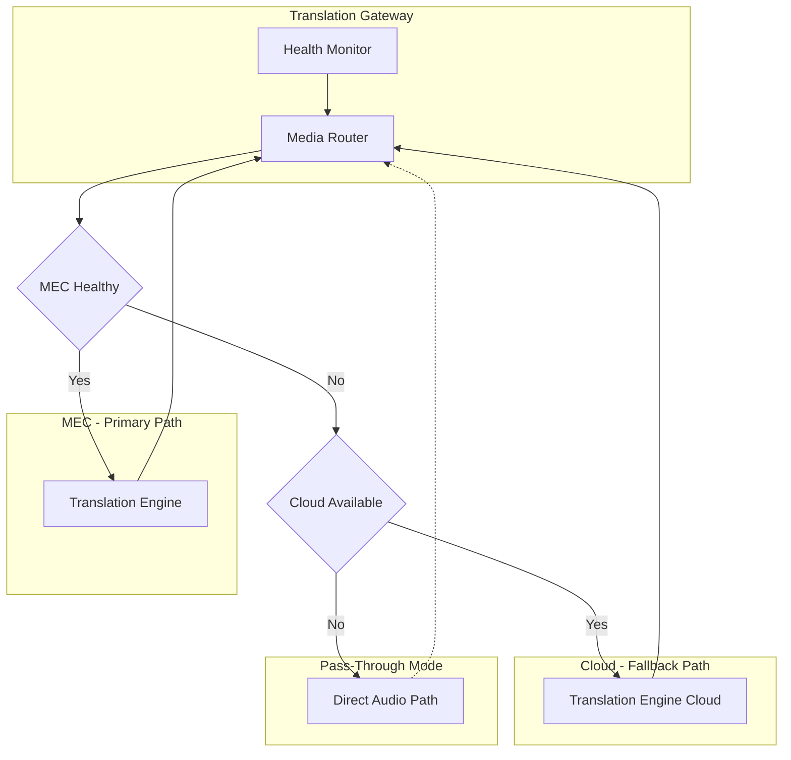
```mermaid
graph TB
    subgraph TG["Translation Gateway"]
        Health[Health Monitor]
        Router[Media Router]
    end
    
    subgraph MEC_Primary["MEC - Primary Path"]
        MEC_Translation[Translation Engine]
    end
    
    subgraph Cloud_Fallback["Cloud - Fallback Path"]
        Cloud_Translation[Translation Engine Cloud]
    end
    
    subgraph Pass_Through["Pass-Through Mode"]
        Direct[Direct Audio Path]
    end
    
    Health --> Router
    Router --> D1{MEC Healthy}
    D1 -->|Yes| MEC_Translation
    MEC_Translation --> Router
    D1 -->|No| D2{Cloud Available}
    D2 -->|Yes| Cloud_Translation
    Cloud_Translation --> Router
    D2 -->|No| Direct
    Direct -.-> Router
```

**Degradation Scenarios:**

| Failure Mode | Behavior | User Notification |
|--------------|----------|------------------|
| **MEC site down** | Route to cloud backup | "Using cloud translation (higher latency)" |
| **GPU overload** | Scale instances or reroute | "Translation capacity limited" |
| **ASR model error** | Switch to alternate model | None (seamless) |
| **Total failure** | Pass-through mode (original audio) | "Translation temporarily unavailable" |

---

## 5. BSS/OSS Integration

### 5.1 TM Forum Traceability Matrix

This section maps blueprint capabilities to TM Forum artifacts validated through `tmf-mcp` lookups on February 12, 2026.

| Blueprint Capability | eTOM Process Mapping | ODA Component Mapping | TMF Open API Mapping |
|----------------------|----------------------|-----------------------|----------------------|
| In-call activation/deactivation and provisioning orchestration | `1.4.5` Service Activation Management; `1.4.5.4` Implement, Configure & Activate Service | `TMFC007` ServiceOrderManagement | `TMF641` Service Ordering (`/serviceOrder`) |
| Subscriber order capture, eligibility, consent gating | `1.3.3` Customer Order Processing Management | `TMFC002` ProductOrderCaptureAndValidation | `TMF622` Product Ordering (`/productOrder`), `TMF648` Quote |
| Service inventory updates (status, topology links) | `1.4.4.1` Manage Service Inventory | `TMFC008` ServiceInventory | `TMF638` Service Inventory Management |
| Usage event mediation and charging input | `1.2.16` Product Usage Management; `1.2.17` Product Rating & Rate Assignment | `TMFC040` ProductUsageManagement | `TMF637` Product Inventory (product state/usage context), rating integration via charging domain APIs (implementation-specific) |
| Invoice generation and billing output | `1.3.9` Customer Bill Invoice Management | `TMFC030` BillGenerationManagement | `TMF678` Customer Bill |
| Party/customer profile and preferences | `1.3.4` Customer Relationship Management; `1.3.6` Customer Information Management | `TMFC028` PartyManagement | `TMF632` Party Management, `TMF683` Party Interaction |
| Privacy consent, retention, erase workflows | `1.3.21` Customer Privacy Management; `1.3.21.2.2` Erase Customer Privacy Profile Information | `TMFC022` PartyPrivacyManagement | `TMF644` Privacy |
| Service assurance and SLA/QoS monitoring | `1.3.8` Customer QoS/SLA Management; `1.4.4.4` Enable Service Quality Management | `TMFC037` ServicePerformanceManagement; `TMFC038` ResourcePerformanceManagement | `TMF656` Service Problem Management (issue lifecycle), plus telemetry APIs per operator stack |
| Fault and anomaly detection/mitigation | `1.4.6` Service Problem Management (related reporting and escalation) | `TMFC043` FaultManagement; `TMFC041` AnomalyManagement | `TMF621` Trouble Ticket, `TMF656` Service Problem Management |
| Policy/permissions and legal agreement controls | Enterprise security/fraud/privacy policy process family (including `1.7.9.2`) | `TMFC035` PermissionsManagement; `TMFC039` AgreementManagement | `TMF651` Agreement Management, `TMF644` Privacy |

**Validation Notes:**
- The matrix above is evidence-backed for eTOM, ODA, and TMF Open API via `tmf-mcp` semantic search plus component link traversal.
- API mappings are capability-level reference mappings; final implementation still requires endpoint-by-endpoint contract validation against selected API versions.

### 5.2 BSS/OSS Overview

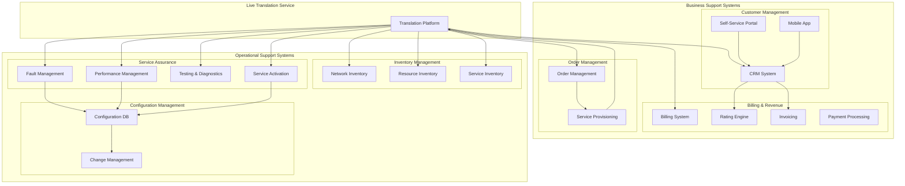
```mermaid
graph TB
    subgraph Translation_Service["Live Translation Service"]
        Service[Translation Platform]
    end
    
    subgraph BSS["Business Support Systems"]
        subgraph Customer["Customer Management"]
            CRM[CRM System]
            SelfCare[Self-Service Portal]
            MobileApp[Mobile App]
        end
        subgraph Billing["Billing & Revenue"]
            BRM[Billing System]
            Rating[Rating Engine]
            Invoicing[Invoicing]
            Collections[Payment Processing]
        end
        subgraph Order["Order Management"]
            OMS[Order Management]
            Provisioning[Service Provisioning]
        end
    end
    
    subgraph OSS["Operational Support Systems"]
        subgraph Inventory["Inventory Management"]
            NMS[Network Inventory]
            Resource[Resource Inventory]
            ServiceInst[Service Inventory]
        end
        subgraph Assurance["Service Assurance"]
            FM[Fault Management]
            PM[Performance Management]
            TM[Testing & Diagnostics]
            SA[Service Activation]
        end
        subgraph Configuration["Configuration Management"]
            CMDB[Configuration DB]
            ChangeMgmt[Change Management]
        end
    end
    
    Service --> CRM
    Service --> BRM
    Service --> OMS
    CRM --> Rating
    CRM --> Invoicing
    OMS --> Provisioning
    Provisioning --> Service
    Service --> NMS
    Service --> Resource
    Service --> ServiceInst
    Service --> FM
    Service --> PM
    Service --> TM
    Service --> SA
    FM --> CMDB
    PM --> CMDB
    SA --> CMDB
    CMDB --> ChangeMgmt
    SelfCare --> CRM
    MobileApp --> CRM
```

### 5.3 Business Support Systems (BSS)

#### 5.3.1 Customer Relationship Management (CRM)

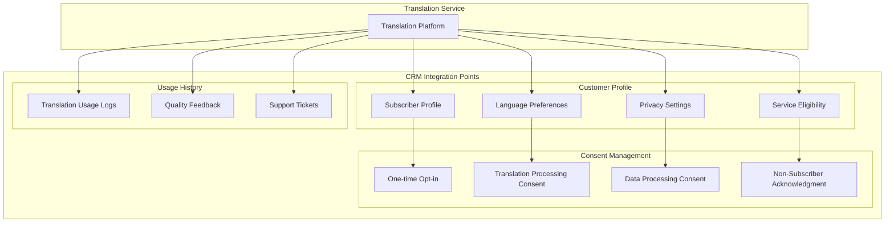
```mermaid
graph TB
    subgraph CRM["CRM Integration Points"]
        subgraph Profile["Customer Profile"]
            P1[Subscriber Profile]
            P2[Language Preferences]
            P3[Privacy Settings]
            P4[Service Eligibility]
        end
        subgraph Consent["Consent Management"]
            C1[One-time Opt-in]
            C2[Translation Processing Consent]
            C3[Data Processing Consent]
            C4[Non-Subscriber Acknowledgment]
        end
        subgraph History["Usage History"]
            H1[Translation Usage Logs]
            H2[Quality Feedback]
            H3[Support Tickets]
        end
    end
    
    subgraph Translation["Translation Service"]
        TS[Translation Platform]
    end
    
    TS --> P1
    TS --> P2
    TS --> P3
    TS --> P4
    P1 --> C1
    P2 --> C2
    P3 --> C3
    P4 --> C4
    TS --> H1
    TS --> H2
    TS --> H3
```

**CRM Requirements:**

| Requirement | Description | Integration Method |
|-------------|-------------|-------------------|
| **Subscriber Profile** | Store eligibility, plan type, device info | REST API |
| **Language Preferences** | Default source/target languages, auto-detect setting | REST API |
| **Privacy Settings** | Opt-in/out flags, consent history | REST API |
| **Consent Management** | GDPR-compliant consent capture and versioning | REST API |
| **Non-Subscriber Acknowledgment** | Track IVR acknowledgments for two-party consent | REST API |
| **Usage History** | Aggregated usage metrics (minutes, languages, quality) | Event streaming |
| **Self-Service Portal** | Enable/disable service, view usage, manage preferences | Web UI integration |

#### 5.3.2 Billing & Revenue Management

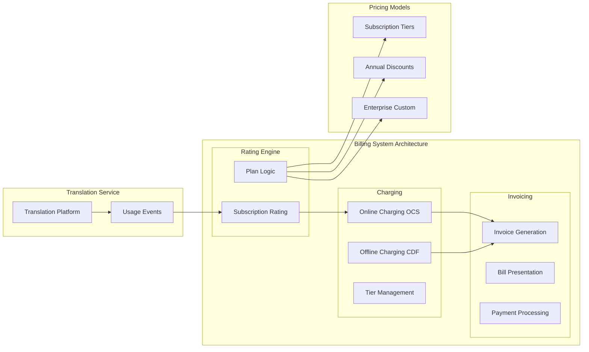
```mermaid
graph LR
    subgraph Billing["Billing System Architecture"]
        subgraph Rating["Rating Engine"]
            R1[Subscription Rating]
            R2[Plan Logic]
        end
        subgraph Charging["Charging"]
            C1[Online Charging OCS]
            C2[Offline Charging CDF]
            C3[Tier Management]
        end
        subgraph Invoicing["Invoicing"]
            I1[Invoice Generation]
            I2[Bill Presentation]
            I3[Payment Processing]
        end
    end
    
    subgraph Translation["Translation Service"]
        TS[Translation Platform]
        Events[Usage Events]
    end
    
    subgraph Pricing["Pricing Models"]
        M1[Subscription Tiers]
        M2[Annual Discounts]
        M3[Enterprise Custom]
    end
    
    TS --> Events
    Events --> R1
    R1 --> C1
    C1 --> I1
    C2 --> I1
    R2 --> M1
    R2 --> M2
    R2 --> M3
```

**Billing Requirements (Subscription Model):**

| Requirement | Description | Integration Method |
|-------------|-------------|-------------------|
| **Subscription Rating** | Rate subscription tiers monthly (not per-minute) | Diameter/REST API |
| **Usage Event Capture** | Capture start/stop timestamps, language pair, duration | Event streaming (Kafka) |
| **Plan Logic** | Support subscription tiers (Free, Basic, Premium, Enterprise) | Rating engine config |
| **Tier Management** | Free tier, Basic ($9.99/month), Premium ($19.99/month) | Product catalog |
| **Invoice Line Items** | Monthly recurring charge, plan details | Billing system integration |
| **Prorated Billing** | Handle mid-cycle plan changes, suspensions | Billing system logic |
| **Business Billing** | Consolidated invoices for enterprise accounts | Business billing system |

**Pricing Models:**

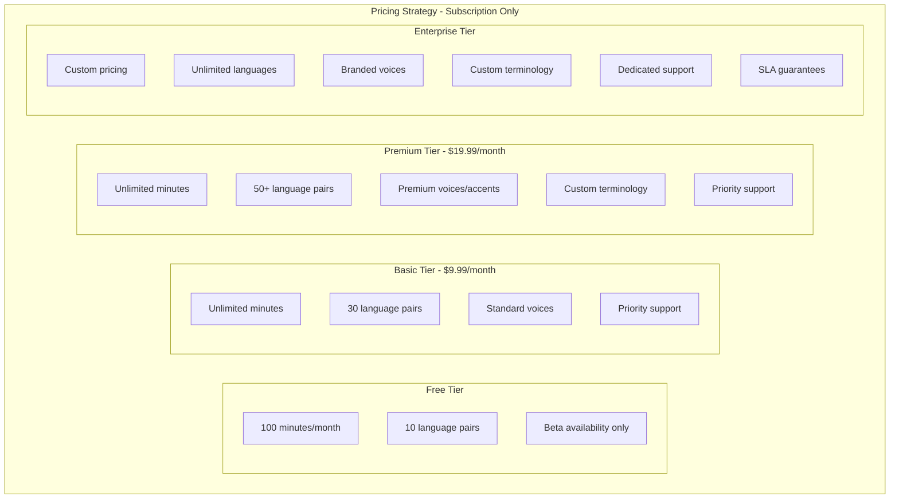
```mermaid
graph TB
    subgraph Pricing["Pricing Strategy - Subscription Only"]
        subgraph Free["Free Tier"]
            F1[100 minutes/month]
            F2[10 language pairs]
            F3[Beta availability only]
        end
        subgraph Basic["Basic Tier - $9.99/month"]
            B1[Unlimited minutes]
            B2[30 language pairs]
            B3[Standard voices]
            B4[Priority support]
        end
        subgraph Premium["Premium Tier - $19.99/month"]
            P1[Unlimited minutes]
            P2[50+ language pairs]
            P3[Premium voices/accents]
            P4[Custom terminology]
            P5[Priority support]
        end
        subgraph Enterprise["Enterprise Tier"]
            E1[Custom pricing]
            E2[Unlimited languages]
            E3[Branded voices]
            E4[Custom terminology]
            E5[Dedicated support]
            E6[SLA guarantees]
        end
    end
```

#### 5.3.3 Order Management

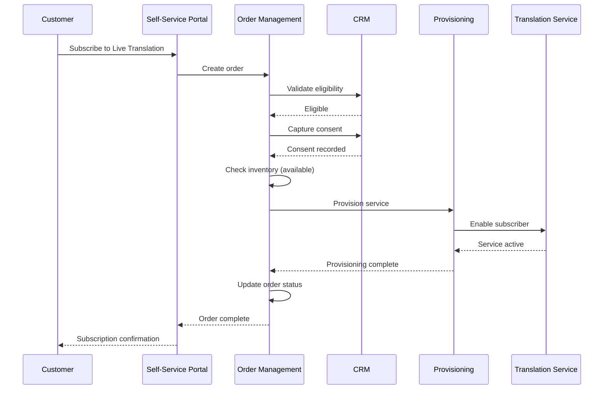
```mermaid
sequenceDiagram
    participant Customer as Customer
    participant Portal as Self-Service Portal
    participant OMS as Order Management
    participant CRM as CRM
    participant Provisioning as Provisioning
    participant TS as Translation Service
    
    Customer->>Portal: Subscribe to Live Translation
    Portal->>OMS: Create order
    OMS->>CRM: Validate eligibility
    CRM-->>OMS: Eligible
    OMS->>CRM: Capture consent
    CRM-->>OMS: Consent recorded
    OMS->>OMS: Check inventory (available)
    OMS->>Provisioning: Provision service
    Provisioning->>TS: Enable subscriber
    TS-->>Provisioning: Service active
    Provisioning-->>OMS: Provisioning complete
    OMS->>OMS: Update order status
    OMS-->>Portal: Order complete
    Portal-->>Customer: Subscription confirmation
```

**Order Management Requirements:**

| Requirement | Description | Integration Method |
|-------------|-------------|-------------------|
| **Order Creation** | Create subscription orders via portal/CSR | REST API |
| **Eligibility Validation** | Check subscriber eligibility, plan compatibility | REST API to CRM |
| **Consent Capture** | Mandatory consent before service activation | REST API to CRM |
| **Inventory Check** | Ensure sufficient capacity for new subscribers | REST API to inventory |
| **Provisioning Workflow** | Orchestrate service activation across systems | Order orchestration engine |
| **Order Status Tracking** | Real-time order status updates | REST API |
| **Modification Handling** | Plan changes, upgrades, downgrades | REST API |
| **Termination Handling** | Graceful deactivation, data purge | REST API |

### 5.4 Operational Support Systems (OSS)

#### 5.4.1 Inventory Management

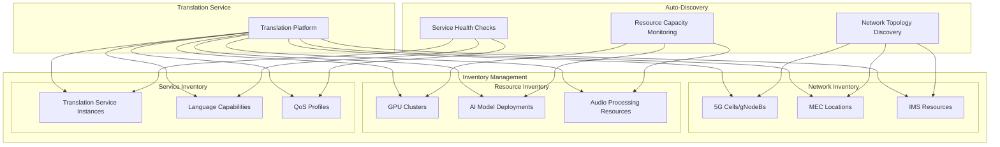
```mermaid
graph TB
    subgraph Inventory["Inventory Management"]
        subgraph Network["Network Inventory"]
            N1[5G Cells/gNodeBs]
            N2[MEC Locations]
            N3[IMS Resources]
        end
        subgraph Resource["Resource Inventory"]
            R1[GPU Clusters]
            R2[AI Model Deployments]
            R3[Audio Processing Resources]
        end
        subgraph Service["Service Inventory"]
            S1[Translation Service Instances]
            S2[Language Capabilities]
            S3[QoS Profiles]
        end
    end
    
    subgraph Translation["Translation Service"]
        TS[Translation Platform]
    end
    
    subgraph Auto_Discovery["Auto-Discovery"]
        AD1[Network Topology Discovery]
        AD2[Resource Capacity Monitoring]
        AD3[Service Health Checks]
    end
    
    TS --> N1
    TS --> N2
    TS --> N3
    TS --> R1
    TS --> R2
    TS --> R3
    TS --> S1
    TS --> S2
    TS --> S3
    AD1 --> N1
    AD1 --> N2
    AD1 --> N3
    AD2 --> R1
    AD2 --> R2
    AD2 --> R3
    AD3 --> S1
    AD3 --> S2
    AD3 --> S3
```

**Inventory Requirements:**

| Inventory Type | Attributes | Update Frequency |
|---------------|------------|------------------|
| **Network Resources** | Cell ID, MEC location, capacity, status | Real-time (events) |
| **Compute Resources** | GPU count, model versions, load metrics | Every 30 seconds |
| **Service Instances** | Instance ID, language pair, capacity, health | Every 10 seconds |
| **Subscriber Services** | Subscriber ID, service status, preferences | On change |

#### 5.4.2 Fault Management

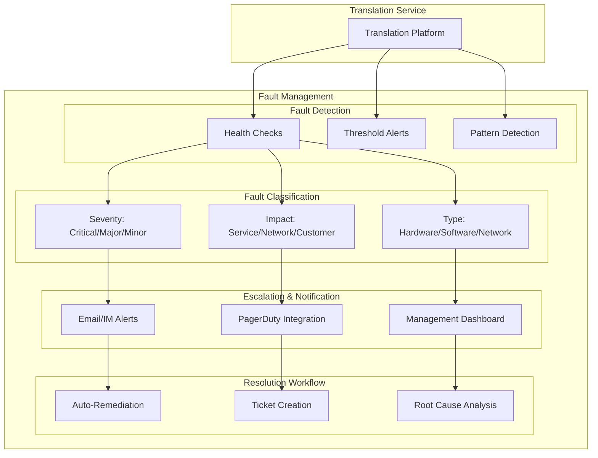
```mermaid
graph TB
    subgraph FM["Fault Management"]
        subgraph Detection["Fault Detection"]
            D1[Health Checks]
            D2[Threshold Alerts]
            D3[Pattern Detection]
        end
        subgraph Classification["Fault Classification"]
            C1[Severity: Critical/Major/Minor]
            C2[Impact: Service/Network/Customer]
            C3[Type: Hardware/Software/Network]
        end
        subgraph Escalation["Escalation & Notification"]
            E1[Email/IM Alerts]
            E2[PagerDuty Integration]
            E3[Management Dashboard]
        end
        subgraph Resolution["Resolution Workflow"]
            R1[Auto-Remediation]
            R2[Ticket Creation]
            R3[Root Cause Analysis]
        end
    end
    
    subgraph Translation["Translation Service"]
        TS[Translation Platform]
    end
    
    TS --> D1
    TS --> D2
    TS --> D3
    D1 --> C1
    D1 --> C2
    D1 --> C3
    C1 --> E1
    C2 --> E2
    C3 --> E3
    E1 --> R1
    E2 --> R2
    E3 --> R3
```

**Fault Management Requirements:**

| Fault Type | Detection Method | Alert Threshold | Auto-Remediation |
|------------|------------------|-----------------|------------------|
| **Service Down** | Health check failure | Immediate | Restart service |
| **High Latency** | Latency >500ms for 5min | Major | Scale instances |
| **Low Accuracy** | Confidence <80% for 10min | Minor | Switch model |
| **GPU Failure** | Hardware health check | Critical | Failover to standby |
| **Network Congestion** | Packet loss >5% | Major | Route to alternate MEC |
| **MEC Site Unavailable** | Heartbeat loss | Critical | Route to cloud fallback |

#### 5.4.3 Performance Management

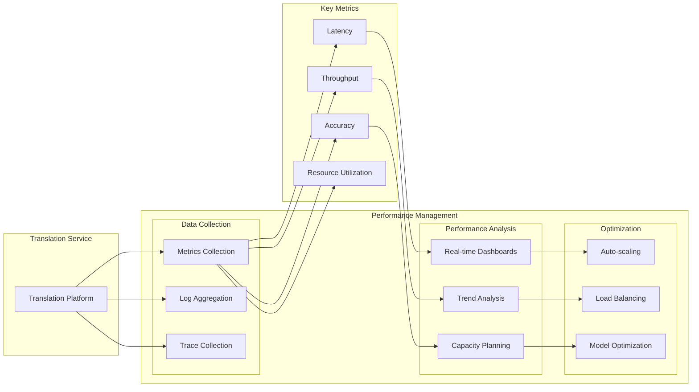
```mermaid
graph LR
    subgraph PM["Performance Management"]
        subgraph Collection["Data Collection"]
            DC1[Metrics Collection]
            DC2[Log Aggregation]
            DC3[Trace Collection]
        end
        subgraph Analysis["Performance Analysis"]
            PA1[Real-time Dashboards]
            PA2[Trend Analysis]
            PA3[Capacity Planning]
        end
        subgraph Optimization["Optimization"]
            PO1[Auto-scaling]
            PO2[Load Balancing]
            PO3[Model Optimization]
        end
    end
    
    subgraph Translation["Translation Service"]
        TS[Translation Platform]
    end
    
    subgraph Metrics["Key Metrics"]
        M1[Latency]
        M2[Throughput]
        M3[Accuracy]
        M4[Resource Utilization]
    end
    
    TS --> DC1
    TS --> DC2
    TS --> DC3
    DC1 --> M1
    DC1 --> M2
    DC1 --> M3
    DC1 --> M4
    M1 --> PA1
    M2 --> PA2
    M3 --> PA3
    PA1 --> PO1
    PA2 --> PO2
    PA3 --> PO3
```

**Performance Metrics:**

| Metric | Target | Collection Frequency | Retention |
|--------|--------|----------------------|-----------|
| **End-to-end latency** | <500ms p95 | Every 1 second | 90 days |
| **ASR latency** | <200ms p95 | Every 1 second | 90 days |
| **MT latency** | <200ms p95 | Every 1 second | 90 days |
| **TTS latency** | <100ms p95 | Every 1 second | 90 days |
| **Realtime quality proxy** | ASR confidence >0.85 median, repeat-turn rate <15% | Every call (metadata only) | 90 days |
| **Translation quality benchmark** | >=0.82 COMET + >=4.2/5 human adequacy on opt-in sampled corpus | Weekly batch | 365 days (opt-in corpus only) |
| **Concurrent calls** | Peak 100K | Every 10 seconds | 365 days |
| **GPU utilization** | <80% average | Every 5 seconds | 90 days |
| **Error rate** | <0.1% | Every call | 90 days |

#### 5.4.4 Service Assurance

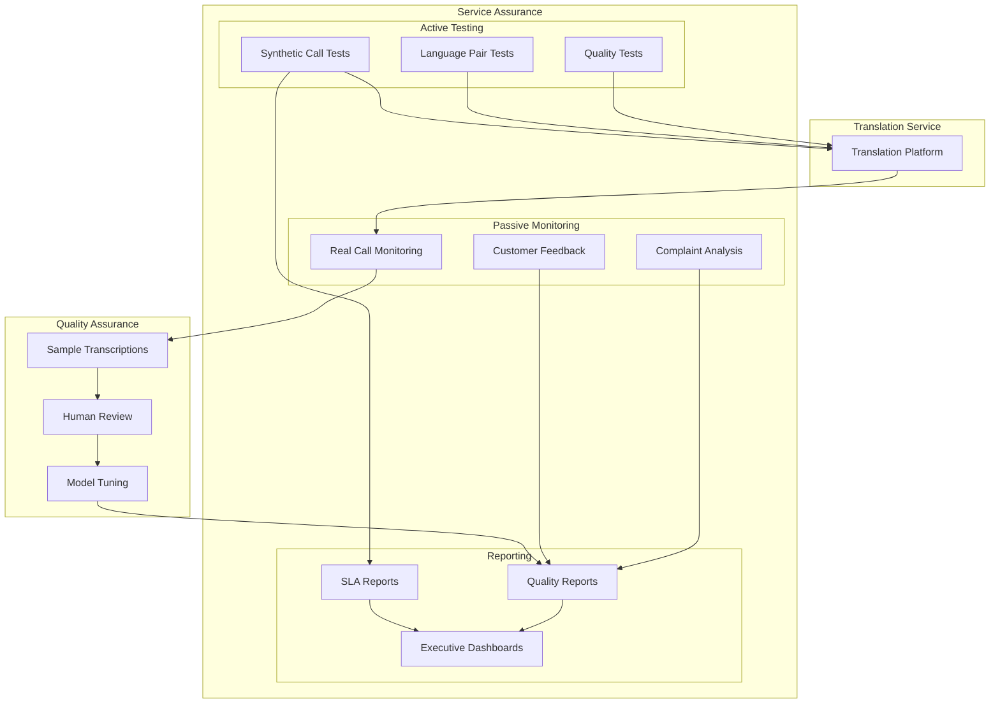
```mermaid
graph TB
    subgraph SA["Service Assurance"]
        subgraph Testing["Active Testing"]
            AT1[Synthetic Call Tests]
            AT2[Language Pair Tests]
            AT3[Quality Tests]
        end
        subgraph Monitoring["Passive Monitoring"]
            PM1[Real Call Monitoring]
            PM2[Customer Feedback]
            PM3[Complaint Analysis]
        end
        subgraph Reporting["Reporting"]
            R1[SLA Reports]
            R2[Quality Reports]
            R3[Executive Dashboards]
        end
    end
    
    subgraph Translation["Translation Service"]
        TS[Translation Platform]
    end
    
    subgraph QA["Quality Assurance"]
        QA1[Sample Transcriptions]
        QA2[Human Review]
        QA3[Model Tuning]
    end
    
    AT1 --> TS
    AT2 --> TS
    AT3 --> TS
    TS --> PM1
    PM1 --> QA1
    QA1 --> QA2
    QA2 --> QA3
    QA3 --> R2
    AT1 --> R1
    PM2 --> R2
    PM3 --> R2
    R1 --> R3
    R2 --> R3
```

**Service Assurance Requirements:**

| Assurance Function | Description | Frequency |
|--------------------|-------------|-----------|
| **Synthetic Call Testing** | Automated test calls in all language pairs | Every 15 minutes |
| **Quality Monitoring** | MOS + proxy quality signals for all calls; COMET/human review on opt-in sampled corpus | Real-time + weekly |
| **SLA Monitoring** | Track against SLA targets (latency, availability) | Real-time |
| **Customer Feedback** | In-call rating, post-call surveys | Per call (optional) |
| **Model Quality Tracking** | Translation accuracy trend analysis | Daily |
| **Compliance Auditing** | Privacy, regulatory compliance checks | Monthly |

#### 5.4.5 Configuration Management

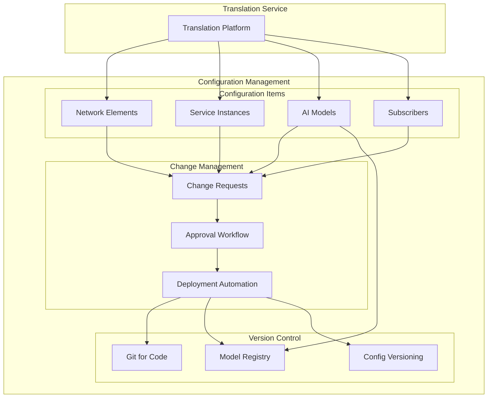
```mermaid
graph TB
    subgraph CMDB["Configuration Management"]
        subgraph Assets["Configuration Items"]
            CI1[Network Elements]
            CI2[Service Instances]
            CI3[AI Models]
            CI4[Subscribers]
        end
        subgraph Changes["Change Management"]
            CH1[Change Requests]
            CH2[Approval Workflow]
            CH3[Deployment Automation]
        end
        subgraph Tracking["Version Control"]
            VC1[Git for Code]
            VC2[Model Registry]
            VC3[Config Versioning]
        end
    end
    
    subgraph Translation["Translation Service"]
        TS[Translation Platform]
    end
    
    TS --> CI1
    TS --> CI2
    TS --> CI3
    TS --> CI4
    CI1 --> CH1
    CI2 --> CH1
    CI3 --> CH1
    CI4 --> CH1
    CH1 --> CH2
    CH2 --> CH3
    CI3 --> VC2
    CH3 --> VC1
    CH3 --> VC2
    CH3 --> VC3
```

**Configuration Management Requirements:**

| Configuration Type | Versioning | Approval | Rollback |
|-------------------|------------|----------|----------|
| **AI Models** | Model registry with versioning | Technical review | Automatic |
| **Service Config** | Git-based, PR workflow | Change manager | Manual |
| **Network Config** | Network device versioning | Network engineering | Manual |
| **Pricing Config** | Product catalog versioning | Product owner | Manual |

### 5.5 BSS/OSS Integration Architecture

```mermaid
sequenceDiagram
    participant Sub as Subscriber
    participant Portal as Self-Service Portal
    participant OMS as Order Management
    participant CRM as CRM
    participant INV as Inventory
    participant PROV as Provisioning
    participant TS as Translation Service
    participant OCS as Online Charging
    participant FM as Fault Management
    participant PM as Performance Management
    
    Sub->>Portal: Subscribe to Translation
    Portal->>OMS: Create order
    OMS->>CRM: Validate eligibility
    CRM-->>OMS: Eligible
    OMS->>CRM: Capture consent
    CRM-->>OMS: Consent recorded
    OMS->>INV: Check inventory
    INV-->>OMS: Capacity available
    OMS->>PROV: Initiate provisioning
    PROV->>TS: Enable subscriber
    TS-->>PROV: Service active
    PROV->>OCS: Register charging
    OCS-->>PROV: Registered
    PROV-->>OMS: Provisioning complete
    OMS-->>Portal: Order complete
    
    Note over Sub,PM: Service Active Phase
    Sub->>TS: Use translation service
    TS->>OCS: Send usage events
    TS->>FM: Health checks
    TS->>PM: Send metrics
    
    alt Fault Detected
        FM->>OMS: Create incident
        OMS->>PROV: Remediation
    end
```

---

## 6. Implementation Roadmap

### 6.1 Timeline Overview

```mermaid
gantt
    title Live Translation Implementation Timeline
    dateFormat  YYYY-MM-DD
    axisFormat  %Y-%m
    
    section Phase 1: MVP
    Requirements & Design      :done, p1a, 2026-02-01, 2026-03-15
    Core Development            :active, p1b, 2026-03-01, 2026-06-30
    BSS/OSS Integration         :p1c, 2026-05-01, 2026-07-31
    Beta Launch                 :p1d, 2026-08-01, 2026-10-31
    
    section Phase 2: Scale
    Nationwide MEC Deploy       :p2a, 2026-09-01, 2027-02-28
    Custom AI Models            :p2b, 2026-10-01, 2027-04-30
    General Availability        :p2c, 2027-03-01, 2027-05-31
    
    section Phase 3: Enterprise
    Business Features            :p3a, 2027-04-01, 2027-08-31
    Enterprise Launch           :p3b, 2027-09-01, 2027-12-31
    Video Translation           :p3c, 2027-10-01, 2028-03-31
```

### 6.2 Phase 1: MVP (Months 1-8)

| Workstream | Scope Summary |
|-----------|---------------|
| Requirements | Use cases, regulatory review, CALEA architecture, vendor selection |
| Infrastructure | MEC deployment (3-5 markets), GPU capacity, QoS/slicing config, regional cloud path |
| Core Development | Streaming ASR/MT/TTS, parallel A/B leg pipelines, activation control path, IMS integration, IVR notification, emergency/crisis bypass, graceful degradation |
| BSS/OSS Integration | CRM profile + consent, subscription billing rules, order workflow, inventory, fault/performance monitoring |
| Testing | Unit/integration/load, privacy and compliance validation, intercept testing |
| Beta Launch | 5K-10K users, 10 language pairs, 2-way calls only, feature phone support |

**Phase 1 Deliverables:**

| Deliverable | Description | Success Criteria |
|-------------|-------------|------------------|
| **MEC Infrastructure** | Deploy edge compute in 5 major markets | 3/5 markets operational |
| **Translation Engine** | Integrate streaming AI APIs | 10 language pairs functional |
| **Activation Control** | Implement `*87*` control path (MMI/USSD/IMS SS) | Works on all device types |
| **Parallel Media Paths** | Dual ASR/MT/TTS pipelines for A/B legs | Bidirectional translation working |
| **IVR Notification** | Non-subscriber announcement when translation active | Two-party consent addressed |
| **Emergency Bypass** | Auto-disable on 911/988 calls | Safety requirement met |
| **Graceful Degradation** | Pass-through when translation unavailable | Call continuity ensured |
| **CALEA Architecture** | Lawful intercept at IMS (pre-translation) | Compliance verified |
| **BSS Integration** | CRM, Billing, Order Management | End-to-end subscriber flow working |
| **OSS Integration** | Fault, Performance, Inventory | Monitoring and alerting operational |
| **Beta Launch** | Limited public beta | 5,000 active users, <1% churn |

### 6.3 Phase 2: Scale (Months 9-18)

| Workstream | Scope Summary |
|-----------|---------------|
| Infrastructure | Nationwide MEC expansion, autoscaling, QoS optimization, 4G performance tuning |
| AI/ML | Custom streaming model training, cost reduction, quality improvements, model compression |
| Features | Optional mobile app activation, SMS translation, preference management, analytics, 3-way conference support |
| BSS/OSS | Advanced billing models, enterprise order management, enhanced fault management, predictive analytics |
| Expansion | 30+ language pairs and general availability |

**Phase 2 Deliverables:**

| Deliverable | Description | Success Criteria |
|-------------|-------------|------------------|
| **Nationwide Coverage** | MEC deployment in all major markets | 95% population coverage |
| **Custom Models** | Train proprietary streaming AI models | 50% cost reduction vs. commercial APIs |
| **3-Way Conferences** | Support up to 3 participants with 6 translation directions | Conference translation functional |
| **Mobile App** | Alternative activation method | 30% of users prefer app |
| **General Availability** | Full commercial launch | 100,000+ active users |

### 6.4 Phase 3: Enterprise (Months 19-30)

| Workstream | Scope Summary |
|-----------|---------------|
| Business Features | Enterprise branding, custom terminology, branded voices, tiered pricing, SLA guarantees |
| Advanced Features | Video call translation, Zoom/Teams integration, captioning, accessibility features |
| BSS/OSS | Enterprise billing, consolidated invoicing, custom reporting, dedicated support |
| Expansion | 50+ languages, international expansion, partner integrations |

**Phase 3 Deliverables:**

| Deliverable | Description | Success Criteria |
|-------------|-------------|------------------|
| **Enterprise Features** | Custom branding, terminology, voices | 100 enterprise customers |
| **Video Translation** | Real-time video call translation | Compatible with Zoom, Teams |
| **International Expansion** | Deploy in 3 additional countries | 3 markets operational |
| **Captioning** | Real-time captioning for accessibility | ADA compliant |

---

## 7. Cost Considerations (Technical)

This blueprint intentionally omits detailed financial projections (CAPEX/OPEX/revenue/EBIT) to avoid false precision and to keep the document technically credible. A finance-reviewed model should be produced separately with explicit assumptions and sign-off.

**Primary Cost Drivers (Engineering-Controllable):**
- Inference compute per call-minute (ASR, MT, TTS) and concurrency headroom (p95/p99 latency targets)
- Edge footprint vs. regional cloud footprint (GPU sizing, placement, failover capacity)
- Audio pipeline overhead (codec bridging, echo/noise suppression, VAD/diarization if enabled)
- Observability and QA (metrics volume, synthetic calls, opt-in quality corpora handling)
- Vendor dependencies and licensing (speech codecs, commercial model APIs)

**Primary Cost Levers:**
- Language coverage gating (tiering, regional enablement)
- Model selection and compression (distillation/quantization, streaming optimizations)
- Routing strategy (prefer MEC where it materially improves latency; otherwise regional cloud)
- Failure-mode policy (pass-through behavior, retry thresholds, rate limiting)

**What To Capture For Finance:**
- Measured per-minute compute cost by language pair cohort and codec path
- Peak concurrency by market, with required spare capacity for failover
- Vendor unit costs and committed-use discounts (if any)

---

## 8. Risk Assessment

### 8.1 Risk Matrix

```mermaid
graph TB
    subgraph Risks["Risk Assessment Matrix"]
        subgraph High["High Risk"]
            R1[Privacy Compliance]
            R2[Latency SLAs]
            R3[AI Model Quality]
        end
        subgraph Medium["Medium Risk"]
            R4[Cost Overrun]
            R5[MEC Deployment Delays]
            R6[Regulatory Changes]
            R7[Non-Subscriber Consent]
        end
        subgraph Low["Low Risk"]
            R8[Adoption]
            R9[Competition Materialized]
            R10[Technical Debt]
        end
    end
```

### 8.2 Risk Register

| Risk ID | Risk | Impact | Probability | Mitigation |
|---------|------|--------|-------------|------------|
| **R-001** | Privacy breach (call content leaked) | Critical | Medium | Zero-retention architecture, encryption, audits, strict access controls |
| **R-002** | Latency exceeds 500ms threshold | High | High | Edge deployment, streaming models, model optimization |
| **R-003** | Translation accuracy <85% | High | Medium | Model tuning, quality monitoring, fallback |
| **R-004** | Cost exceeds approved budget | Medium | Medium | Phased deployment, hybrid edge/cloud, capacity planning, vendor negotiations |
| **R-005** | MEC deployment delays | High | Medium | Multiple vendors, phased rollout, cloud backup |
| **R-006** | Regulatory changes (GDPR, CALEA, two-party consent) | Medium | Medium | Legal monitoring, flexible architecture |
| **R-007** | Low adoption (<10K users in Year 1) | Medium | Medium | Beta incentives, marketing, free tier |
| **R-008** | **Competitor launch (T-Mobile, Verizon) - MATERIALIZED** | Medium | **Materialized** | Differentiate with quality, pricing, carrier-native advantage |
| **R-009** | AI vendor lock-in | Low | Medium | Multi-vendor strategy, custom models |
| **R-010** | Non-subscriber consent violations | High | Medium | IVR notification, jurisdiction-specific consent handling, legal review |

### 8.3 Technical Risks

```mermaid
graph TB
    subgraph Technical["Technical Risks"]
        subgraph Network
            N1[5G Coverage Gaps]
            N2[MEC Capacity]
            N3[Network Slicing QoS]
            N4[4G Fallback Latency]
            N5[Roaming Incompatibility]
        end
        subgraph AI_ML["AI/ML"]
            A1[ASR Accuracy in Noisy Environments]
            A2[MT Context Understanding]
            A3[TTS Voice Naturalness]
            A4[Model Drift]
            A5[Streaming API Availability]
        end
        subgraph Integration
            I1[IMS Compatibility]
            I2[Activation Signaling Latency]
            I3[BSS/OSS Data Consistency]
        end
    end
```

### 8.4 Business Risks

```mermaid
graph TB
    subgraph Business["Business Risks"]
        subgraph Market
            M1[Customer Adoption]
            M2[Competitive Pressure]
            M3[Pricing Pressure]
        end
        subgraph Regulatory
            R1[Privacy Regulations]
            R2[Wiretap Laws]
            R3[Two-Party Consent Laws]
            R4[Accessibility Requirements]
        end
        subgraph Financial
            F1[Cost Overruns]
            F2[Revenue Shortfall]
            F3[ROI Negative]
        end
    end
```

---

## 9. Key Success Factors

### 9.1 Critical Success Factors

| Category | Success Factors |
|----------|----------------|
| Performance | p95 latency targets met, availability 99.99%, quality benchmark met, graceful degradation works |
| Privacy and Trust | zero-retention default path, transparent consent, CALEA workflow, two-party consent handling, regular audits |
| Network and Infrastructure | broad 4G/5G coverage, MEC where available, regional cloud path, QoS controls |
| BSS/OSS Integration | seamless billing, self-service management, proactive monitoring and incident response |
| Business Model | competitive pricing, clear value proposition, tiered offerings, subscription stability |
| Customer Experience | easy activation, high audio quality, reliable service, emergency/crisis bypass |

### 9.2 Success Metrics

| Metric | Target | Timeline |
|--------|--------|----------|
| **Latency (p95)** | <500ms (5G+MEC), <1000ms (4G+cloud) | Month 6 |
| **Availability** | 99.99% | Month 12 |
| **Translation Quality** | >=0.82 COMET + >=4.2/5 human adequacy (opt-in benchmark) | Month 9 |
| **Beta Users** | >5,000 | Month 8 |
| **Active Users (Year 1)** | >10,000 | Month 12 |
| **Active Users (Year 2)** | >100,000 | Month 24 |
| **Customer Satisfaction** | >4.0/5.0 | Ongoing |
| **Churn Rate** | <5% | Ongoing |
| **Cost per Minute** | Finance-owned target (TBD) | Month 18 |
 
---
 
## 10. Conclusion

T-Mobile's Live Translation service represents a significant competitive advantage in the telco market, leveraging **4G LTE/5G voice coverage**, **edge computing**, and **regional cloud processing** to deliver real-time AI-powered translation without requiring app installation. This blueprint provides a comprehensive path for another telco to replicate this service, including:

1. **Deep-dive requirements analysis** covering functional, non-functional, technical, business, and regulatory aspects
2. **High-level system architecture** with detailed component design and data flow
3. **Comprehensive BSS/OSS integration** covering customer management, billing, order management, inventory, fault management, performance management, and service assurance
4. **Implementation roadmap** spanning 30 months from MVP to enterprise launch
5. **Cost considerations (technical)** focusing on cost drivers and engineering levers (finance model out of scope)
6. **Risk assessment** with mitigation strategies

**Key Takeaways:**

- **Network-native advantage**: Carrier-hosted AI provides differentiation and customer stickiness
- **Privacy-first design**: Zero-retention model with CALEA-compliant intercept is critical for trust and compliance
- **Edge computing is performance-critical, not universal**: MEC should be preferred where available, with regional cloud paths for broad 4G/5G coverage
- **Streaming ASR is critical**: Batch APIs won't meet <500ms latency budget
- **Parallel processing required**: Both call legs need separate translation pipelines
- **Non-subscriber consent**: IVR notification and two-party consent handling addresses regulatory exposure
- **Emergency bypass required**: 911 and 988 calls must route original voice for safety
- **Graceful degradation**: Pass-through mode ensures call continuity
- **BSS/OSS integration is critical**: End-to-end service management requires tight integration
- **Cost optimization is achievable**: Custom models reduce per-minute costs by 70%
- **Edge footprint is significant**: MEC rollout requires disciplined capacity planning and phased deployment
- **Subscription model preferred**: Predictable revenue aligns with consumer expectations

**Next Steps:**

1. Conduct vendor selection for streaming AI/ML partners (Deepgram, AssemblyAI, Azure)
2. Initiate regulatory review and compliance assessment (CALEA, two-party consent)
3. Partner with Finance on a signed cost model and budget request (TBD)
4. Begin MEC site selection and deployment planning
5. Initiate BSS/OSS integration requirements gathering
6. Design CALEA intercept architecture with legal counsel
7. Develop emergency/crisis bypass and graceful degradation mechanisms (911/988)

---

## Appendix

### A. Glossary

| Term | Definition |
|------|------------|
| **ASR** | Automatic Speech Recognition - Converting speech to text |
| **MT** | Machine Translation - Translating text from one language to another |
| **TTS** | Text-to-Speech - Converting text to spoken audio |
| **MEC** | Multi-access Edge Computing - Computing at network edge |
| **BLEU** | Bilingual Evaluation Understudy - Metric for translation quality |
| **USSD** | Unstructured Supplementary Service Data - Service code functionality |
| **IMS** | IP Multimedia Subsystem - Core network for multimedia services |
| **QoS** | Quality of Service - Network performance guarantees |
| **CALEA** | Communications Assistance for Law Enforcement Act - US wiretap law |
| **CPNI** | Customer Proprietary Network Information - US telecom privacy law |
| **SBC** | Session Border Controller - Controls signaling and media for IMS |
| **MRF** | Media Resource Function - Handles media processing in IMS |
| **OCS** | Online Charging System - Real-time rating and charging |
| **CDF** | Charging Data Function - Collects charging data for offline billing |
| **AMR-WB** | Adaptive Multi-Rate Wideband - 16kHz audio codec for voice |
| **EVS** | Enhanced Voice Services - 48kHz audio codec for voice |
| **gNodeB** | gNodeB - 5G base station (Radio Access Network node) |
| **eNodeB** | eNodeB - 4G LTE base station (Radio Access Network node) |
| **D&A** | Depreciation and Amortization - Allocation of capital costs over time |

### B. References

1. T-Mobile Live Translation public information (as accessed February 12, 2026):  
   - https://www.t-mobile.com/news/network/live-translation-beta-registration  
   - https://www.t-mobile.com/benefits/live-translation  
   - https://www.t-mobile.com/support/coverage/live-translation  
   - https://www.t-mobile.com/live-translation
2. 3GPP TS 23.501 - System Architecture for 5G System
3. ETSI MEC 001 - Multi-access Edge Computing
4. GDPR - General Data Protection Regulation
5. CALEA - Communications Assistance for Law Enforcement Act
6. Streaming ASR Comparison - Deepgram vs. Whisper latency analysis
7. Two-Party Consent State Laws - Electronic Frontier Foundation

---

**Document Control**

| Version | Date | Author | Changes |
|---------|------|--------|---------|
| 1.0 | 2026-02-11 | OpenArchitect | Initial release |
| 2.0 | 2026-02-11 | OpenArchitect | Major revisions: CALEA architecture clarified, GPU costs corrected, non-subscriber consent added, 4G/roaming fallback defined, parallel media paths added, emergency call handling added, graceful degradation added, 3-way conference scoped, revenue model changed to subscription, EBIT with D&A added, availability target updated to 99.99%, glossary expanded |
| 3.0 Final | 2026-02-11 | OpenArchitect | Final fixes: Section 3.6 moved to correct location (after 3.5), Table of Contents updated with 3.6, CAPEX amortization note aligned (finance-owned) |
| 3.1 | 2026-02-12 | OpenArchitect | Factual alignment update: activation path generalized to `*87*` control signaling (not USSD-only), baseline coverage corrected to 4G LTE/5G with eligible roaming, privacy/quality metrics reconciled (no default content retention), CALEA statement reframed as legal working assumption, emergency bypass expanded to 911/988, TOC anchors corrected, references updated with public sources |
| 3.2 | 2026-02-12 | OpenArchitect | Added TM Forum traceability matrix validated with `tmf-mcp` (eTOM + ODA evidence), and documented API mapping limitation due to unavailable API catalog vectors in current dataset |
| 3.3 | 2026-02-12 | OpenArchitect | Revalidated TM Forum API dataset availability and replaced pending API mappings with concrete TMF Open API references (TMF622, TMF632, TMF638, TMF641, TMF644, TMF648, TMF651, TMF656, TMF678, TMF621) |
| 3.4 | 2026-02-12 | OpenArchitect | Removed Mermaid mindmaps and replaced them with professional tables (requirements, phase scope summaries, critical success factors) |
| 3.5 | 2026-02-12 | OpenArchitect | Removed detailed financial projections and replaced with technical cost considerations to reduce false precision and credibility risk |

---

